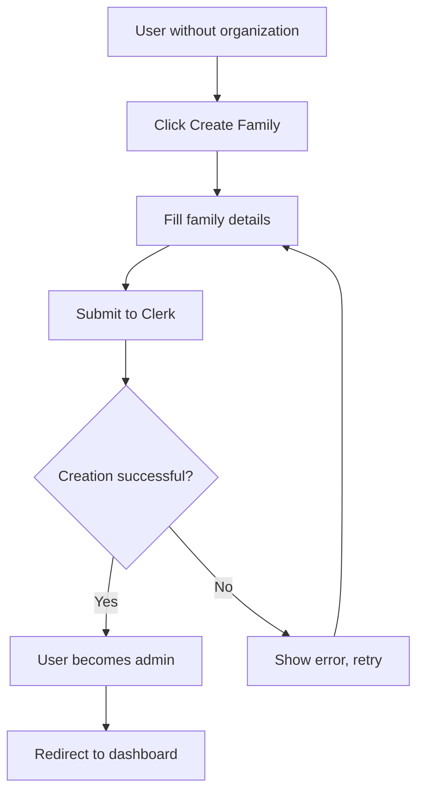
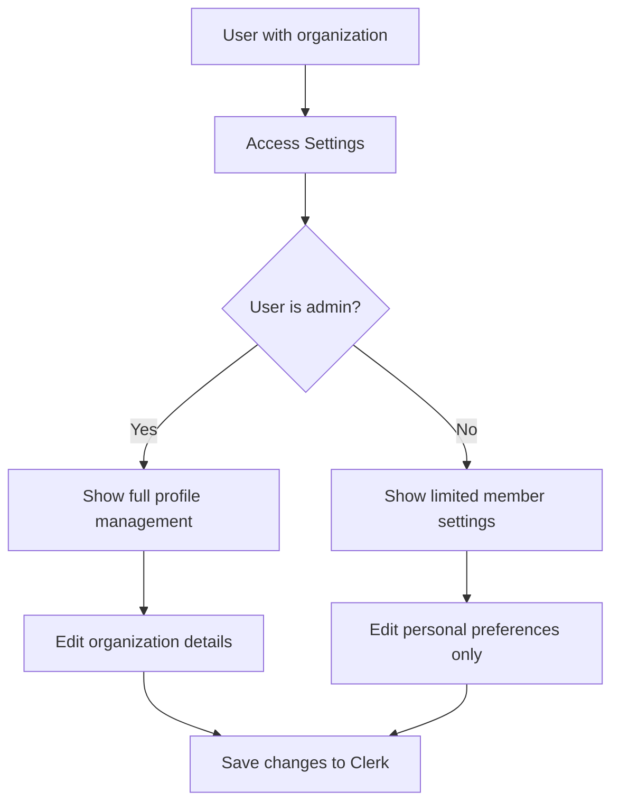

# Data Model: Family Organization Management

**Feature**: Family Organization Management | **Date**: 2025-09-10

## Entity Overview

This feature leverages Clerk's Organizations system for family management, eliminating the need for custom data models while providing all necessary functionality.

## Primary Entities

### Family Organization (Clerk Organization)
**Managed By**: Clerk Organizations API  
**Purpose**: Represents a family unit with members, roles, and settings

| Field | Type | Description | Validation |
|-------|------|-------------|------------|
| `id` | string | Unique organization identifier | Auto-generated by Clerk |
| `name` | string | Family name (e.g., "The Smith Family") | Required, 1-100 characters |
| `slug` | string | URL-friendly identifier | Auto-generated from name |
| `createdAt` | DateTime | Organization creation timestamp | Auto-set by Clerk |
| `updatedAt` | DateTime | Last modification timestamp | Auto-updated by Clerk |
| `imageUrl` | string | Family photo/avatar URL | Optional, validated URL |
| `metadata` | object | Custom family preferences | JSON object, max 8KB |

**Relationships**:
- One-to-Many: Organization → Members (via Clerk membership system)
- One-to-Many: Organization → Invitations (via Clerk invitation system)

**Business Rules**:
- Each user can belong to multiple organizations (families)
- Organization creator automatically becomes admin
- Organization name must be unique within user's accessible organizations
- Metadata used for family preferences (meal times, activity preferences, etc.)

### User Membership (Clerk Organization Membership)
**Managed By**: Clerk Organizations API  
**Purpose**: Links users to family organizations with role-based permissions

| Field | Type | Description | Validation |
|-------|------|-------------|------------|
| `userId` | string | Clerk user identifier | Required, must exist |
| `organizationId` | string | Family organization identifier | Required, must exist |
| `role` | string | User role in family | admin \| basic_member |
| `createdAt` | DateTime | Membership creation timestamp | Auto-set by Clerk |
| `updatedAt` | DateTime | Last role change timestamp | Auto-updated by Clerk |

**Role Definitions**:
- **admin**: Full family management (edit org, invite/remove members, change settings)
- **basic_member**: Family participation (view activities, use resources, limited settings)

**Business Rules**:
- Family creator automatically gets admin role
- At least one admin required per family organization
- Admin can promote/demote other members
- Members can leave family (with confirmation)

### Organization Profile (Clerk Organization Settings)
**Managed By**: Clerk Organizations API  
**Purpose**: Family-specific settings and preferences accessible through user settings

| Field | Type | Description | Validation |
|-------|------|-------------|------------|
| `publicMetadata` | object | Family public information | JSON object, visible to all members |
| `privateMetadata` | object | Family private settings | JSON object, admin-only |
| `maxAllowedMemberships` | number | Maximum family members | 1-50 (configurable) |

**Metadata Schema** (Custom Business Logic):
```typescript
interface FamilyMetadata {
  preferences: {
    mealPlanningDay?: 'sunday' | 'monday' | 'tuesday' | 'wednesday' | 'thursday' | 'friday' | 'saturday';
    activityReminders?: boolean;
    weeklyDigest?: boolean;
  };
  settings: {
    timezone?: string;
    language?: string;
    childSafetyMode?: boolean;
  };
  household: {
    address?: string; // For location-based recommendations
    memberCount?: number; // For resource scaling
  };
}
```

## State Transitions

### Family Creation Flow


### Organization Settings Flow


## Data Validation Rules

### Client-Side Validation
- **Family Name**: Required, 1-100 characters, no special characters except spaces, hyphens, apostrophes
- **Family Slug**: Auto-generated, URL-safe, unique within user scope
- **Metadata**: JSON schema validation, size limits enforced

### Server-Side Validation (Clerk)
- **Organization Limits**: Maximum organizations per user (configurable)
- **Member Limits**: Maximum members per organization
- **Role Constraints**: At least one admin per organization
- **Data Integrity**: Foreign key constraints on user-organization relationships

## Privacy & Security Considerations

### Data Classification (Per Constitution)
- **Organization ID**: Internal (safe to log, use in URLs)
- **Organization Name**: Confidential (family name, PII considerations)
- **Member List**: Restricted (requires authorization to access)
- **Metadata**: Restricted (family private information)

### Access Control
- **Public Metadata**: Readable by all organization members
- **Private Metadata**: Readable/writable by organization admins only
- **Member Management**: Admin-only operations
- **Organization Settings**: Role-based access per Clerk RBAC

### Data Retention
- **Clerk Policy**: Organizations and memberships retained per Clerk's data retention policy
- **User Control**: Users can leave organizations, admins can delete organizations
- **Cascading Deletion**: Organization deletion removes all memberships and metadata
- **Audit Trail**: Organization changes logged by Clerk (accessible to admins)

## Integration Points

### With Existing App Features
- **Navigation**: Organization status affects menu items and routing
- **Dashboard**: Displays family-specific content when organization exists
- **User Settings**: Organization profile integrated into settings section
- **Marketing Pages**: Non-members see family creation CTAs

### With External Systems
- **Clerk API**: Primary data source for all organization operations
- **Analytics**: Organization events tracked (creation, member changes, settings updates)
- **Performance**: Clerk caching and CDN for organization data
- **Monitoring**: Organization API health checks and error tracking

## Database Schema (None Required)
This feature requires no additional database tables as all data is managed by Clerk's organization system. The app interacts with organization data through Clerk's APIs and React hooks.

**Benefits**:
- Zero database migration required
- Built-in security and validation
- Automatic scaling and performance
- GDPR/privacy compliance included
- Real-time updates via Clerk webhooks

---

**Data model design complete ✓**  
**Ready for contract generation**